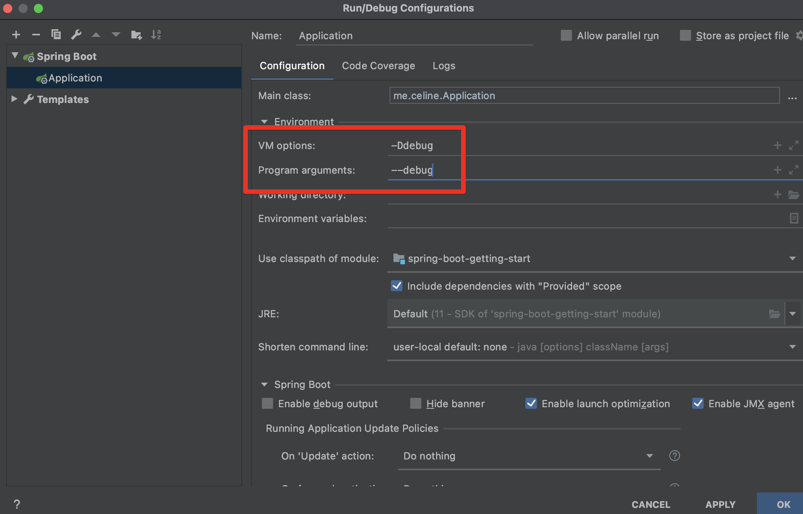

# Spring Application

## SpringApplication

스프링 어플리케이션의 기본 로그 설정은 INFO이다.

debug 모드로 시작하고 싶다면 다양하지만 가장 기본적으로는

run/debug Configurations 에서 VM options랑 program arguments **둘 중 하나**를 적어주면 된다.



→ 애플리케이션이 디버그 모드로 실행되고 log도 debug 모드로 찍힘

= 어떤 자동설정이 적용됐는지 또는 왜 적용안됐는지 궁금할 때 사용할 수 있다.

[https://docs.spring.io/spring-boot/docs/current/reference/html/features.html#features.spring-application](https://docs.spring.io/spring-boot/docs/current/reference/html/features.html#features.spring-application)

**FailureAnalyzer**: 에러가 났을 때 에러메세지를 좀 더 이쁘게 출력해주는 기능.

스프링부트에는 이미 여러가지가 기본적으로 등록되어있고 직접만들수도있다. 하지만 직접만들일 거의 없음

**배너**


변경할 수 있음 → resource 폴더에 banner 파일 넣어주면 됨 → .txt, .gif, .jpg, .png 가능

위치도 변경하려면, 프로퍼티 설정을 해준다.

```basic
spring.banner.location=classpath:banner.txt
```

- 배너에 사용할 수 있는 여러가지 변수


${spring-boot.version} 과 같은 것은 그냥 사용할 수 있지만

${application.~ } 과 같이 MANIFEST.MF  파일이 필요한 것들은, 해당 파일이 package시 생성되기 때문에

package 후, jar 파일을 실행해서 확인 가능함 (package는 모든 의존성을 포함한 jar파일을 생성)


그냥 실행했을 시 → application.version이 출력되지 않는것을 볼 수 있다.


package해서, jar파일을 실행하면 → application.version이 출력되는 것을 볼 수 있다.

배너는 application에 직접 설정도 가능하다. 하지만 파일의 우선순위가 더 높다. 


아래의

app.setBannerMode(Banner.Mode.OFF); 처럼 배너를 끌 수도 있다.

스프링 어플리케이션을 커스마이징 하기위해서는 빌더를 쓰거나, 인스턴스를 만들어서 사용한다.

- 빌더

```java
public static void main(String[] args){
        new SpringApplicationBuilder()
                .sources(Application.class)
                .run(args);
   }
```

- 인스턴스를 만들어서 사용하는 방법

```java
public static void main(String[] args) {
       SpringApplication application = new SpringApplication(Application.class);
       // application.setWebApplicationType(WebApplicationType.REACTIVE);
       // application.addListeners(new SampleListner());
       // application.setBannerMode(Banner.Mode.OFF);
       application.run(args); //application의 기본 로그 레벨이 info
   }
// 이렇게 어플리케이션을 선언 후 사용하는 방법이 커스터마이징 하기 좋다. 
```

가장 쉬운 run 방법은, 커스터마이징이 불가능하다. 

```java
public static void main(String[] args) {
        SpringApplication.run(Application.class,args);
        //스프링어플리케이션이 주는 다양한 기능을 사용하기 어려운 방법
    }
```

## Application Event 등록

스프링부트가 실행해주는 다양한 이벤트는 각자 실행되는 다양한 시점이 있다. 

이벤트 리스터를 생성할 때,

애플리케이션 컨텍스트가 생성된 후의 실행되는 이벤트 리스터들은 빈등록을 해주면 된다.

생성되기 전에 실행되는 리스너들은 빈등록이 소용이 없으니 직접 메인에서 리스너 추가해줘야한다.

- 애플리케이션 컨텍스트가 실행되기 전 리스너

```java
public static void main(String[] args) {
       SpringApplication application = new SpringApplication(Application.class)
       application.addListeners(new SampleListner()); //리스너 등록
       application.run(args); //application의 기본 로그 레벨이 info
   }
```


→ application에 리스너를 등록해줌으로써 이벤트 발생 시 출력됨 

- 애플리케이션 컨텍스트가 실행된 후의 리스너


→ 빈으로 등록해줌으로써 이벤트 발생 시 출력됨

## WebApplicationType 설정

mvc가 들어있으면 기본으로 서블릿타입으로 실행되고, 웹플럭스가 있으면 리액티브로 실행된다.

만약 둘다 있다면 서블릿 타입이 무조건 우선이다.

바꾸고 싶다면 setWebApplicatonType 메서드를 사용해서 애플리케이션에 적용한다.

```java
public static void main(String[] args) {
       SpringApplication application = new SpringApplication(Application.class);
       application.setWebApplicationType(WebApplicationType.REACTIVE);
       application.run(args); 
   }
```

## 애플리케이션 아규먼트 사용하기


: 스프링부트의 빈에, 생성자가 한개고 그 생성자에 파라미터가 빈일 경우(applicationArguments는 빈) 스프링이 알아서 생성해준다. 

ApplicationRunner는 @Order 도 적용해서 여러개의 순서를 지정해 사용할 수도 있다.

### ApplicationRunner와 CommandLineRunner의 차이점

둘다 jvm option은 생략되고 arguments옵션만 출력가능하다.


그런데 applicationRunner 가, ApplicaionArguments 클래스로 args를 받아서, 사용할 수 있는 기능과 메서드가 많으니 더 추천한다.

