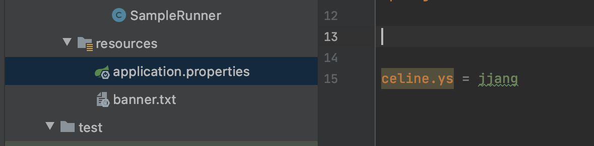

# 외부 설정

사용할 수 있는 외부 설정

- properties
- YAML
- 환경 변수
- 커맨드 라인 아규먼트



프로퍼티 외부 설정 사용하는 방법.

[application.properties](http://application.properties) : 스프링부트가 구동시, 자동으로 로딩해주는 규약 컨벤션

키 = value 로 이루어져있음


[https://docs.spring.io/spring-boot/docs/current/reference/htmlsingle/#boot-features-external-config](https://docs.spring.io/spring-boot/docs/current/reference/htmlsingle/#boot-features-external-config)

### 프로퍼티 우선 순위

1. 유저 홈 디렉토리에 있는 spring-boot-dev-tools.properties
2. 테스트에 있는 @TestPropertySource
3. @SpringBootTest 애노테이션의 properties 애트리뷰트
4. 커맨드 라인 아규먼트
5. SPRING_APPLICATION_JSON (환경 변수 또는 시스템 프로티) 에 들어있는 프로퍼티
6. ServletConfig 파라미터
7. ServletContext 파라미터
8. java:comp/env JNDI 애트리뷰트
9. System.getProperties() 자바 시스템 프로퍼티
10. OS 환경 변수
11. RandomValuePropertySource
12. JAR 밖에 있는 특정 프로파일용 application properties
13. JAR 안에 있는 특정 프로파일용 application properties
14. JAR 밖에 있는 application properties
15. JAR 안에 있는 application properties
16. @PropertySource
17. 기본 프로퍼티 (SpringApplication.setDefaultProperties)

application.properties 우선 순위 (높은게 낮은걸 덮어 씁니다.)

1. file:./config/
2. file:./
3. classpath:/config/
4. classpath:/

랜덤값 설정하기

- ${random.*}

플레이스 홀더

- name = keesun
- fullName = ${name} baik

### application.properties 우선 순위 (높은게 낮은걸 덮어 씁니다.)

1. file:./config/
2. file:./
3. classpath:/config/
4. classpath:/

classpath : tartget 안의 classes 폴더라는걸 이제야 앎ㅎ_ㅎ


### test properties 사용방법


test/resources 폴더 만들어주구 프로젝트 설정가서 위에 Test Resources 버튼 눌러주면 오른쪽과 같이 생김


해당 폴더에 application.properties를 만들고, 이렇게 test를 하면 test에서는 test 폴더의 application.properties를 가져옴

### main [application.properties](http://application.properties) 보다. test의 application.properties 가 우선순위가 더 높은 것에 대한 문제점


main에 이렇게 celine.age를 추가 후 빌드하면, test에 있는 application.properties에는 age가 없다는 에러가 뜸.

>> 테스트 폴더에 application.properties가 없으면 에러안남, 있으면 뒤집어 쓰는 것.

### 프로퍼티를 이용하는 다양한 방법

- ${ramdom.*} 사용가능
- name= keesun , fullName = ${name} baik 과 같이, 위에 선언되어있는 키를 사용 가능
- 타입-세이프 프로퍼티 @ConfigurationProperties 로 여러 프로퍼티를 묶어서 읽어올 수 있음.


→ "celine"이라는 profix를 가진 properties들을 가져와서 사용

@Component를 사용해서 빈 등록 후, 다른 클래스에서 사용가능.

spring Boot Configuration Annotaion Processor not cinfigured 

: 프로젝트를 빌드할 때 클래스를 분석해서 meta 정보를 생성해주는 플로그인을 추가하라는 의미

→ spring-boot-configuration-processor  dependency 추가해줌

```xml
<dependency>
        <groupId>org.springframework.boot</groupId>
        <artifactId>spring-boot-configuration-processor</artifactId>
        <optional>true</optional>
</dependency>
```

다른 클래스에서 해당 빈을 가져와 이용한 예시.


### 융통성 있는 바인딩

: 프로퍼티는 아래 4개의 경우를 융통성 있게 읽어 데이터에 매핑해줌

- context-path (케밥)
- context_path (언드스코어)
- contextPath (캐멀)
- CONTEXTPATH

### 프로퍼티 타입 컨버전

: 스프링부트의 컨버전 서비스, 값이 타입에 맞게 변형됨

- @DurationUnit : 초로 변환시켜주는 것, 혹은 이걸 안쓰고 숫자뒤에 s를 붙혀도 초로 변형됨


:내가 104초를 입력했더니 1M44S 로 변형됨 

### 프로퍼티 값 검증

- @Validated : 하이버네티드 구현체를 사용하고 있음
- JSR-303 (@NotNull, ...)

[https://stackoverflow.com/questions/61959918/spring-boot-validations-stopped-working-after-upgrade-from-2-2-5-to-2-3-0](https://stackoverflow.com/questions/61959918/spring-boot-validations-stopped-working-after-upgrade-from-2-2-5-to-2-3-0)

참고 :2.3.1부터는 validation이 spring-boot-start-web의 기본 사항이 아님 


[https://github.com/spring-projects/spring-boot/wiki/Spring-Boot-2.3-Release-Notes#validation-starter-no-longer-included-in-web-starters](https://github.com/spring-projects/spring-boot/wiki/Spring-Boot-2.3-Release-Notes#validation-starter-no-longer-included-in-web-starters)


```xml
<dependency>
        <groupId>org.springframework.boot</groupId>
        <artifactId>spring-boot-starter-validation</artifactId>
</dependency>
```

을 추가해주고 동작.


자주 사용하는 어노테이션 예제

- **@NotNull** : 해당 값에 Null을 허용하지 않음
- **@NotBlank** : Null을 허용하지 않으며 문자가 한 개 이상 포함되어야 함 (공백 제외)
- **@NotEmpty** : Null을 허용하지 않으며 공백 문자열을 허용하지 않음
- **@AssertTrue** : true인지 확인
- **@Min** : 값이 Min보다 작은지 확인
- **@Max** : 값이 Max보다 큰지 확인
- **@Size** : 값이 min과 max사이에 해당하는지 확인 (CharSequence, Collection, Map, Array에 해당)

### @Value

위에 사용한 프로퍼티 사용법과 @Value를 사용한 프로퍼티 사용법의 차


- SpEL 을 사용할 수 있지만...
- 위에 있는 기능들은 전부 사용 못합니다.

# 프로파일

@Configuration과 @Component에, @Profile 어노테이션을 달아, 환경에 맞게 동작 시킬 수 있음


>> prod에만 실행될 수 있도록

결과물

```java

@Component
public class SampleRunner implements ApplicationRunner {

    @Autowired
    String hello;

    @Override
    public void run(ApplicationArguments args) throws Exception {
        System.out.println("====================");
        System.out.println(hello);
        System.out.println("====================");
    }
}
```


특정 프로파일을 active해서 실행하는 가장 기본적인 방법


이런식으로 이용해서 application-properties들도 여러개를 각 환경에 맞게 이용할 수 있음


참고 : 영상에 나온, spring.profiles.include는 2.4.*  부터는 사용불가함.. 

[https://stackoverflow.com/questions/64907675/including-profiles-in-spring-boot-2-4-0-version](https://stackoverflow.com/questions/64907675/including-profiles-in-spring-boot-2-4-0-version)

.. 대체 방법에 대한 이해가 잘 안됨..! 누가 알려주세요..!

## <외부설정 과정에서 생겼던 문제들 : celine 실수담>


내가 spring-boot-starter-test가 아닌 spring-boot-test를 추가함.. 차이는 각자 찾아보는 걸로..


또 문제 : spring-boot-starter-test로 들어가보면 junit이 5점대가 되어있음. 


[https://www.whiteship.me/springboot-no-more-runwith/](https://www.whiteship.me/springboot-no-more-runwith/)

junit 5점대 부터는 @Runwith를 사용하지 않음. 


assertThat도 사용하지 않음

[https://goddaehee.tistory.com/211](https://goddaehee.tistory.com/211)

>> Junit5가 되서 변한점

!!!!!!!그래서 @Runwith 빼주고 assetThat을 then으로 바꿨는데 Environment가 null이 되는 문제 발생!!!!!


→ 다시 Runwith를 추가해줬더니 됨. why why why!!!! 나는 junit 5점 대인데 왜!!!!!!!!!!!!!!


>>

문제는 나에게 있었음


이걸 또 언제 추가해놨는지 내가 추가해놓음


>> 그래서 Junit의 4점대와 5점대가 같이 들어가 있는 현상 발생!!!!!!

그래서 프로젝트를 새로 만드니


Junit 5점대만 정상적으로 들어가고. 


>> 정상적으로 Runwith 와 Then만으로도 동작이 되고 environment도 되지만 최신버전에서는 @Value로도 받을 수 있게됨  >> 해피엔딩.

