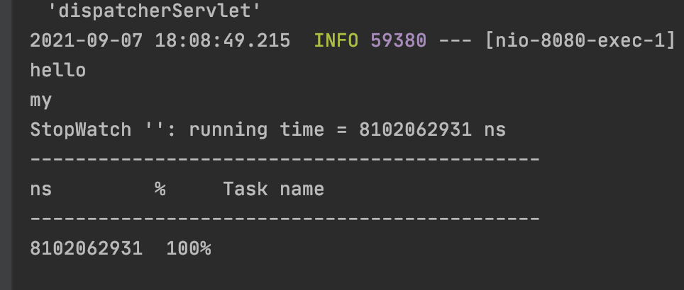
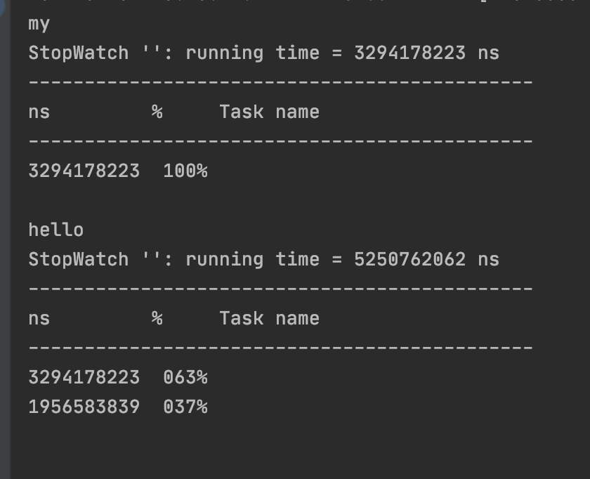

# 스프링 Rest 클라이언트

Rest 클라이언트는 스프링 프레임웤이 지원하는거고, 스프링부트는 restClinet를 쉽게사용할 수 있는 빈을 등록해줌 

- RestTemplate**Builder**
- WebClient.**Builder**

: 둘 다 사용할 수 있고, 둘 중 하나만 사용해도 됨

# RestTemplate과 WebClient

### RestTemplate

- web module이 들어있으면 restTemplate을 쓸 수 있다.
- Blocking I/O 기반의 Synchronous API
- RestTemplateAutoConfiguration
- 프로젝트에 spring-web 모듈이 있다면 RestTemplate**Builder**를 빈으로 등록해 줍니다.
- [https://docs.spring.io/spring/docs/current/spring-framework-reference/integration.html#rest-client-access](https://docs.spring.io/spring/docs/current/spring-framework-reference/integration.html#rest-client-access)

```java
@Component
public class RestRunner implements ApplicationRunner {

    @Autowired
    RestTemplateBuilder restTemplateBuilder;

    @Override
    public void run(ApplicationArguments args) throws Exception {
        RestTemplate restTemplate = restTemplateBuilder.build();

        StopWatch stopWatch = new StopWatch();
        stopWatch.start();

        //hello
        String result1 = restTemplate.getForObject("http://localhost:8080/hello",String.class);
        System.out.println(result1);

        //my
        String result2 = restTemplate.getForObject("http://localhost:8080/my",String.class);
        System.out.println(result2);

        stopWatch.stop();
        System.out.println(stopWatch.prettyPrint());
    }
}
```



### WebClient

- webclient를 사용하려면 webflux가 의존성이 들어와있어야함
- 기본으로 Reactor Netty의 HTTP 클라이언트 사용.
- 커스터마이징
    - 로컬 커스터마이징
    - 글로벌 커스터마이징
        - WebClientCustomizer
        - 빈 재정의

```xml
<dependency>
    <groupId>org.springframework.boot</groupId>
    <artifactId>spring-boot-starter-webflux</artifactId>
</dependency>
```

```java
public class RestRunner implements ApplicationRunner {

    @Autowired
    WebClient.Builder builder;

    @Override
    public void run(ApplicationArguments args) throws Exception 

        WebClient webClient = builder.build();
        StopWatch stopWatch1 = new StopWatch();
        stopWatch1.start();

        Mono<String> helloMono = webClient.get().uri("http://localhost:8080/hello")
                .retrieve().bodyToMono(String.class);
        helloMono.subscribe( s -> {
            System.out.println(s);

            if(stopWatch1.isRunning()){
                stopWatch1.stop();
            }
            System.out.println(stopWatch1.prettyPrint());
            stopWatch1.start();
        });

        Mono<String> myMono = webClient.get().uri("http://localhost:8080/my")
                .retrieve().bodyToMono(String.class);
        myMono.subscribe( s -> {
            System.out.println(s);

            if(stopWatch1.isRunning()){
                stopWatch1.stop();
            }
            System.out.println(stopWatch1.prettyPrint());
            stopWatch1.start();
        });
      
    }
}
```



: 더 추천하지만 공부하고 써라

# 커스터마이징

### webClient 커스터마이징

```java
@Bean
    public WebClientCustomizer webClientCustomizer(){
        return webClientBuilder -> webClientBuilder.baseUrl("http://localhostL8080");
    }
```

WebClientBuilder 자체를 다시 등록할 수도 있다. 

### javanet의 httpConnection을 사용하지않고 apache의 httpClient를 사용하는 방법

```xml
<dependency>
    <groupId>org.apache.httpcomponents</groupId>
    <artifactId>httpclient</artifactId>
</dependency>
```

```java
@Bean
    RestTemplateCustomizer restTemplateCustomizer(){
        return new RestTemplateCustomizer() {
            @Override
            public void customize(RestTemplate restTemplate) {
                restTemplate.setRequestFactory(new HttpComponentsClientHttpRequestFactory());
            }
        };
    }
}
```

1. 그밖에 다양한 기술 연동
- 캐시
- 메시징 : 프로토콜 : JMS, AMQP, Apache Kafka
- Validation
- 이메일 전송
- JTA
- 스프링 인티그레이션
- 스프링 세션
- JMX : 모니터링
- 웹소켓
- 코틀린
- ...