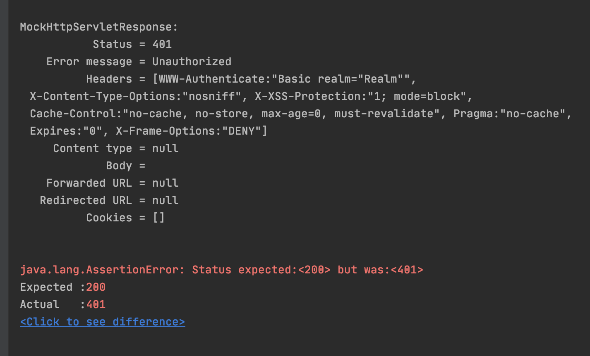

# 스프링 부트 시큐리티

## *사전준비*

1. 타임리프 의존성 추가 : 타임리프 사용해서 뷰렌더링 테스트를 하기 위함

```xml
<dependency>
    <groupId>org.springframework.boot</groupId>
    <artifactId>spring-boot-starter-thymeleaf</artifactId>
</dependency>
```

1. 컨트롤러 생성 : 두가지 방법 : 아래 두코드는 같은 것

```java
@Configuration
public class WebConfig implements WebMvcConfigurer {
    @Override
    public void addViewControllers(ViewControllerRegistry registry){
        registry.addViewController("/hello").setViewName("hello");
    }
}
```

```java
@Controller
public class HomeController { //장점: 모델, 컨트리뷰트 등
    @GetMapping("/hello")
    public String hello(){
        return "hello";
    }
}
```

1. html 생성

```java
<!DOCTYPE html>
<html lang="en">
<head>
    <meta charset="UTF-8">
    <title>Title</title>
</head>
<body>
<h1>Welcome</h1>
<a href="/hello">hello</a>
<a href="/my">my</a>
</body>
</html>
```


1. 테스트 생성

```java
package me.celine.springbootsecurity;

import org.junit.jupiter.api.Test;
import org.springframework.beans.factory.annotation.Autowired;
import org.springframework.boot.test.autoconfigure.web.servlet.WebMvcTest;
import org.springframework.test.web.servlet.MockMvc;

import static org.junit.jupiter.api.Assertions.*;
import static org.springframework.test.web.servlet.request.MockMvcRequestBuilders.get;
import static org.springframework.test.web.servlet.request.MockMvcRequestBuilders.post;
import static org.springframework.test.web.servlet.result.MockMvcResultHandlers.print;
import static org.springframework.test.web.servlet.result.MockMvcResultMatchers.*;
import static org.hamcrest.Matchers.is;
import static org.hamcrest.core.IsEqual.equalTo;

@WebMvcTest(HomeController.class)
class HomeControllerTest {

    @Autowired
    MockMvc mockMvc;

    @Test
    public void hello() throws Exception {
        mockMvc.perform(get("/hello"))
                .andDo(print())
                .andExpect(status().isOk())
                .andExpect(view().name("hello"));
    }

    @Test
    public void my() throws Exception {
        mockMvc.perform(get("/my"))
                .andDo(print())
                .andExpect(status().isOk())
                .andExpect(view().name("my"));
    }

}
```

# Spring Boot Security

```xml
<dependency>
    <groupId>org.springframework.boot</groupId>
    <artifactId>spring-boot-starter-security</artifactId>
</dependency>
```

- security 추가 후 다시 테스트 돌려보면 401 에러 발생



: 모든 요청이 시큐리티로 인해 인증을 필요로하게 됨, 

: basic authentication에 대한 인증과 폼인증을 둘다 적용 됨.

### 베이직 인증은 Accept 헤더에 따라 달라진다.


→ TEXT_HTML로 요청하면, 스프링부트가 기본적으로 제공하는 로그인 폼으로 이동 : 


- Username 과 Password

    Username : user 이 기본

### Security Bean


→  빈으로 등록해서 커스터마이징 가능. 


: 들어가보면 우리가 로그인 폼에서 볼 수 있는 다양한 error가 있다.

옛날과 지금. 


: SpringSecurityConfiguration에서 WebSecurityConfiguration 의존성이 없어짐


DefaultWebSecurityCondition 에 들어가면 의존성이 다시 존재 → 결과적으로 똑같지만 코드구조는 달라진듯

### configure


: 우리가 form 로그인을 볼 수 있는 이유

### UserDetailsServiceAutoConfiguration


: 비번 만들어주는 곳 : UserDetailService가 없을 때 적용. :스프링 security의 주요 역할

### 테스트 시 security를 넘어가는 방법

1. 의존성 추가

```xml
<dependency>
    <groupId>org.springframework.security</groupId>
    <artifactId>spring-security-test</artifactId>
    <version>${spring-security.version}</version>
</dependency>
```

1. @withMockUser 어노테이션 추가 


### WebSecurityConfigurerAdapter 커스터마이징하는법 : web security 설정

```java
@Configuration
public class WebSecurityConfig extends WebSecurityConfigurerAdapter {
    @Override
    protected void configure(HttpSecurity http) throws Exception {
        http.authorizeRequests()
                .antMatchers("/","/hello").permitAll()
                .anyRequest().authenticated()
                .and()
                .formLogin().and()
                .httpBasic();
    }
}
```

:/와 /hello는 모두에게 허락, 나머지는 인증요구. 폼로그인 사용, httpBasic사용

: userDetailsService가 없으니 여전히 유저는 생성

: accept에 기존적으로 html이 잇으니까 폼로그인에걸리고 없으면 httpBasic에 걸릴 것. 

### UserDetailsService 커스터마이징 하는법

:

[https://docs.spring.io/spring-security/site/docs/current/reference/htmlsingle/#jc-authentication-userdetailsservice](https://docs.spring.io/spring-security/site/docs/current/reference/htmlsingle/#jc-authentication-userdetailsservice)

```java
import org.springframework.security.core.userdetails.User;
import org.springframework.security.core.userdetails.UserDetails;
import org.springframework.security.core.userdetails.UserDetailsService;
import org.springframework.security.core.userdetails.UsernameNotFoundException;

@Service
public class Accountservice implements UserDetailsService {

    @Autowired
    private AccountRepository accountRepository;

    public Account createAccount(String username,String password){
        Account account = new Account();
        account.setUserName(username);
        account.setPassWord(password);
        return accountRepository.save(account);
    }

						  //핵심적인 interface
		@Override //로그인 때 입력한 username이 여기로 들어와서 실제 패스워드가 들어있는 password를 가져가서 확인
    public UserDetails loadUserByUsername(String s) throws UsernameNotFoundException {
        Optional<Account> byUsername = accountRepository.findByUserName(s);
        Account account = byUsername.orElseThrow(() -> new UsernameNotFoundException(s));
        return new User(account.getUserName(),account.getPassWord(),autorities());
    }

    private Collection<? extends GrantedAuthority> autorities() {
        return Arrays.asList(new SimpleGrantedAuthority("ROLE_USER"));
    }

}
```

스프링 시큐리티 5 버전 이후로 password Encoder가 복잡해짐


: 사용안하면 null 에러남

### PASSWORD ENCODER 종류

: 다양한 인코더 지원

[https://www.notion.so/4b0b7d2bae774d65960a22cdaaaa78a2#a8202302a0f44f2085767ea5a7931a6f]()


noOpPasswordEncoder = 실제로는 절대쓰면안됨  : 인코드,디코드 없는 인코더

```java
@Bean
    public PasswordEncoder passwordEncoder(){
        return PasswordEncoderFactories.createDelegatingPasswordEncoder();
    }
```

: 스프링부트 추천 


: 저장부터 encoder 사용해서 저장해야함

### 스프링 부트 시큐리티 테스트

- [https://docs.spring.io/spring-security/site/docs/current/reference/html/test-method.html](https://docs.spring.io/spring-security/site/docs/current/reference/html/test-method.html)