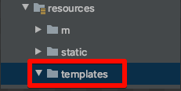

# 웹 MVC 7부~11부

# 7부. Thymeleaf

템플릿 엔진 : 웹 mvc로 동적 컨텐츠를 생성하는 방법

(뷰 만들 때, 이메일 템플릿 만들 때, 코드 제너레이션 과 같은 기본 템플릿은 같은데 특정한 부분의 값만 바꿔 사용할 때)


스프링 부트가 자동 설정을 지원하는 템플릿 엔진

- FreeMarker
- Groovy
- **Thymeleaf : 비교적 최근에 만들어진 템플릿 엔진**
- Mustache


JSP를 권장하지 않는 이유

- JAR 패키징 할 때는 동작하지 않고, WAR 패키징 해야 함.
- Spring Boot 공식 지원 내장 WAS 인 Undertow는 JSP를 지원하지 않음.
- [https://docs.spring.io/spring-boot/docs/current/reference/htmlsingle/#boot-features-jsp-limitations](https://docs.spring.io/spring-boot/docs/current/reference/htmlsingle/#boot-features-jsp-limitations)


Thymeleaf 사용하기

- pom.xml에 의존성 추가

```xml
<dependency>
        <groupId>org.springframework.boot</groupId>
        <artifactId>spring-boot-starter-thymeleaf</artifactId>
</dependency>
```

- 모든 동적 뷰는  /src/main/resources/templates 디텍토리에서 찾게 된다.




$$
TestCode 생성 단축키 다들 아셨는지?  shift + command + T
$$


- 컨트롤러 작성

```java
@Controller
public class SampleController {
    
    @GetMapping("/sample")
    public String sample(Model model){
        return "sample"; //뷰 
    }
}
```


- 테스트 코드 작성

```java
import org.junit.jupiter.api.Test;
import org.springframework.beans.factory.annotation.Autowired;
import org.springframework.boot.test.autoconfigure.web.servlet.WebMvcTest;
import org.springframework.http.MediaType;
import org.springframework.test.web.servlet.MockMvc;

import static org.hamcrest.Matchers.is;
import static org.junit.jupiter.api.Assertions.*;
import static org.springframework.test.web.servlet.request.MockMvcRequestBuilders.get;
import static org.springframework.test.web.servlet.result.MockMvcResultMatchers.*;

@WebMvcTest(SampleController.class)
class SampleControllerTest {

    @Autowired
    MockMvc mockMvc;

    @Test
    public void hello() throws Exception {
        //요청 "/sample"
        //응답
        // - 모델 name : celine
        // - 뷰 이름 : sample

        mockMvc.perform(get("/sample"))
                .andExpect(status().isOk())
                .andExpect(view().name("sample"))
                .andExpect(model().attribute("name",is("celine")));

    }
}
```


- sample 이름을 가진 템플릿을 생성하지 않은 채로, 그냥 실행하면


: thymeleaf가 템플릿을 찾을 수 없다고 에러를 보냄.

- sample template 생성
- [https://www.thymeleaf.org/](https://www.thymeleaf.org/)
- [https://www.thymeleaf.org/doc/articles/standarddialect5minutes.html](https://www.thymeleaf.org/doc/articles/standarddialect5minutes.html)

예제:

[https://github.com/thymeleaf/thymeleafexamples-stsm/blob/3.0-master/src/main/webapp/WEB-INF/templates/seedstartermng.html](https://github.com/thymeleaf/thymeleafexamples-stsm/blob/3.0-master/src/main/webapp/WEB-INF/templates/seedstartermng.html)


: 테스트 결과 성공


- andDo(print()) 메서드 사용


→ 본문(렌더링된 결과)를 확인하는 것은 서블릿엔진(template 을 완성 시킴)이 개입해야만 가능한 것이였는데,

이 것을 thymeleaf(서블릿 컨테이너에 독립적인 엔진)가 해줌으로써, 서블릿엔진을 개입시키지않고도 최종적인 뷰를 확인할 수 있다. 


>  model().attribute에 is()메서드 사용하지 않아도 확인 가능


# 8부. HtmlUnit

: html을 단위테스트하기 위한 툴로, html에 특화된 test 작성이 가능하다.

webClient로 요청을 보내고 결과를 받아서, htmlPage로 본문을 가져올 수 있다.

form에 submit 테스트, 특정 브라우저 타입으로 Test, Element 가져와서 확인 혹은 비교가 다 가능하다.


- 의존성 추가

```xml
<dependency>
   <groupId>org.seleniumhq.selenium</groupId>
   <artifactId>htmlunit-driver</artifactId>
   <scope>test</scope>
</dependency>
<dependency>
   <groupId>net.sourceforge.htmlunit</groupId>
   <artifactId>htmlunit</artifactId>
   <scope>test</scope>
</dependency>
```


- 테스트 코드 작성

    Xpath : xml 문서를 네비게이션 할 때 유용한 문법이다

```java
import com.gargoylesoftware.htmlunit.WebClient;
import com.gargoylesoftware.htmlunit.html.HtmlHeading1;
import com.gargoylesoftware.htmlunit.html.HtmlPage;
import org.assertj.core.api.Assertions;
import org.junit.jupiter.api.Test;
import org.springframework.beans.factory.annotation.Autowired;
import org.springframework.boot.test.autoconfigure.web.servlet.WebMvcTest;

@WebMvcTest(SampleController.class)
class SampleControllerTest2 {

    @Autowired
    WebClient webClient;

    @Test
    public void hello() throws Exception {
        HtmlPage page = webClient.getPage("/sample");
        HtmlHeading1 h1 = page.getFirstByXPath("//h1");
        Assertions.assertThat(h1.getTextContent()).isEqualToIgnoringCase("celine");
    }
}
```

# 9부. ExceptionHandler

: 기본적으로 SpringBoot에 등록되어있다.


- BasicErrorController : HTML과 JSON 응답 지원


```java
public BasicErrorController(ErrorAttributes errorAttributes, ErrorProperties errorProperties, List<ErrorViewResolver> errorViewResolvers) {
        super(errorAttributes, errorViewResolvers);
        Assert.notNull(errorProperties, "ErrorProperties must not be null");
        this.errorProperties = errorProperties;
    }

    @RequestMapping(
        produces = {"text/html"}
    )
    public ModelAndView errorHtml(HttpServletRequest request, HttpServletResponse response) {
        HttpStatus status = this.getStatus(request);
        Map<String, Object> model = Collections.unmodifiableMap(this.getErrorAttributes(request, this.getErrorAttributeOptions(request, MediaType.TEXT_HTML)));
        response.setStatus(status.value());
        ModelAndView modelAndView = this.resolveErrorView(request, response, status, model);
        return modelAndView != null ? modelAndView : new ModelAndView("error", model);
    }

    @RequestMapping
    public ResponseEntity<Map<String, Object>> error(HttpServletRequest request) {
        HttpStatus status = this.getStatus(request);
        if (status == HttpStatus.NO_CONTENT) {
            return new ResponseEntity(status);
        } else {
            Map<String, Object> body = this.getErrorAttributes(request, this.getErrorAttributeOptions(request, MediaType.ALL));
            return new ResponseEntity(body, status);
        }
    }
```

: 웹에서 호출하면 html 형식의 에러 응답 제공


: 터미널에서 호출하면 json형식의 error 응답 제공 


- 에러페이지 커스터 마이징 방법: Error Contoller 구현, @ExceptionHandler 사용

```java
import org.springframework.web.bind.annotation.ExceptionHandler;
import org.springframework.web.bind.annotation.GetMapping;
import org.springframework.web.bind.annotation.RestController;

@RestController
public class SampleRestController {

    @GetMapping("/sampleError")
    public String sample(){
        throw new SampleException();
    }

    @ExceptionHandler(SampleException.class)
    public AppError sampleError(SampleException e){
        AppError appError = new AppError();
        appError.setMessage("error.app.key");
        appError.setReason("IDK IDK");
        return appError;
    }
}
```

```java
public class SampleException extends RuntimeException {
}
```


: ExceptionHandler를 전역적으로 사용하고 싶다면, class를 따로 만들어서

**@ControllerAdvice**를 붙혀서 사용

: 해당 클래스는, ErrorController를 상속받아, 아예 처음부터 구현해도 되고

BasicErrorcontroller를 상속 받아, 스프링부트가 제공해주는 기능도 이용하면서 커스터마이징 할 수 있다. 


- 커스텀 에러 페이지
    - 상태 코드 값에 따라 에러 페이지 보여주기
    
    - src/main/resources/static|template/error/
    
    - 404.html

    - 5xx.html

    - ErrorViewResolver 구현 : 동적으로 에러페이지를 만들 때 다양하게 커스터마이징하는 방법.
    
           ex) 해당 에러를 서버로 보내시겠습니까? 와 같은
    
       
    
    - template 예제


- ErrorViewResolver 구현 예제

[https://docs.spring.io/spring-boot/docs/current/reference/htmlsingle/#features.developing-web-applications.embedded-container.jsp-limitations](https://docs.spring.io/spring-boot/docs/current/reference/htmlsingle/#features.developing-web-applications.embedded-container.jsp-limitations)

```java
//For more complex mappings, 
//you can also add beans that implement the ErrorViewResolver interface,
// as shown in the following example:

public class MyErrorViewResolver implements ErrorViewResolver {

    @Override
    public ModelAndView resolveErrorView(HttpServletRequest request, HttpStatus status, Map<String, Object> model) {
        // Use the request or status to optionally return a ModelAndView
        if (status == HttpStatus.INSUFFICIENT_STORAGE) {
            // We could add custom model values here
            new ModelAndView("myview");
        }
        return null;
    }

}

//You can also use regular Spring MVC features such as
// @ExceptionHandler methods and @ControllerAdvice.
// The ErrorController then picks up any unhandled exceptions.
```


# 10부. Spring HATEOAS

: hateoas를 구현하기위해 편리한 기능을 제공하는 툴

HATEOAS : **H**ypermedia **A**s **T**he **E**ngine **O**f **A**pplication **S**tate
서버: 현재 리소스와 연관된 링크 정보를 클라이언트에게 제공한다.
클라이언트: 연관된 링크 정보를 바탕으로 리소스에 접근한다.
연관된 링크 정보
* Relation
* Hypertext Reference)

-> 즉, 리소스에 대한 정보를 제공ㄷ할 때 리소스와 관련된 링크를 같이 제공

- pom.xml 의존성 추가

```xml
<dependency>
    <groupId>org.springframework.boot</groupId>
    <artifactId>spring-boot-starter-hateoas</artifactId>
</dependency>
```

: web만 넣어도, bean등록 되기는 함.

hateoas 의존성이, objectMapper, LinkDiscovers를 같이 추가해준다.


**ObjectMapper 제공**

- spring.jackson.*
- Jackson2ObjectMapperBuilder

**LinkDiscovers 제공**

- 클라이언트 쪽에서 링크 정보를 Rel 이름으로 찾을때 사용할 수 있는 XPath 확장 클래스
- [https://spring.io/understanding/HATEOAS](https://spring.io/understanding/HATEOAS)
- [https://spring.io/guides/gs/rest-hateoas/](https://spring.io/guides/gs/rest-hateoas/)
- [https://docs.spring.io/spring-hateoas/docs/current/reference/html/](https://docs.spring.io/spring-hateoas/docs/current/reference/html/)

```json
{
  "content":"Hello, World!",
  "_links":{
    "self":{
      "href":"http://localhost:8080/greeting?name=World"
    }
  }
}
```

:요청 URI가 변경되더라도 클라이언트에서 동적으로 생성된 URI를 사용함으로써, 클라이언트가 URI 수정에 따른 코드를 변경하지 않아도 되는 편리함을 제공합니다.


```java
import org.springframework.hateoas.EntityModel;
impot org.springframework.web.bind.annotation.GetMapping;
import org.springframework.web.bind.annotation.RestController;

import static org.springframework.hateoas.server.mvc.WebMvcLinkBuilder.*;

@RestController
public class HateoasSampleController {

    @GetMapping("/hateoas")
    public EntityModel<AirPods> hateoas(){
        AirPods airPods = new AirPods();
        airPods.setPrefix("Hey, ");
        airPods.setName("celine");

        EntityModel<AirPods> resource = new EntityModel<>(airPods);
        resource.add(linkTo(methodOn(HateoasSampleController.class).hateoas()).withSelfRel());
        return resource;
    }
}
```


> 도큐먼트에 다음과 같이 나와있습니다. 참고하세요.

> > `ResourceSupport` is now `RepresentationModel`
> >
> >  `Resource` is now `EntityModel``
> >
> > ``Resources` is now `CollectionModel``
> >
> > `PagedResources` is now `PagedModel`


> 마찬가지로 linkTo 임포트 안되시는 분들은 임포트 부분을 다음으로 바꿔보세요
>
> > **import static org.springframework.hateoas.server.mvc.WebMvcLinkBuilder.*;**


- 결과 화면


# 11부. CORS

**C**ross **O**rigin **R**esource **S**haring

: sop을 우회하기 위한 웹 브라우저가 지원하는 표준 기술 : 서로 다른 origin에 요청 가능

- Single-Origin Policy : 같은 origin에만 요청 가능
- Origin?
    - URI 스키마 (http, https)
    - hostname (whiteship.me, localhost)
    - 포트 (8080, 18080)

→ spring에서 cors를 쓰려면, 여러 bean 설정을 해줘야하는데 spring boot는 이미 해줬기때문에 bean 설정 없이 사용이 가능하다. : @CrossOrigin , webconfig 이용

[https://docs.spring.io/spring/docs/5.0.7.RELEASE/spring-framework-reference/web.html#mvc-cors](https://docs.spring.io/spring/docs/5.0.7.RELEASE/spring-framework-reference/web.html#mvc-cors)


- 뷰 작성(ajax 이용 테스트)

```html
<!DOCTYPE html>
<html lang="en">
<head>
    <meta charset="UTF-8">
    <title>HI CELINE</title>
</head>
<body>
<h1> yeah!! yeah!! </h1>
you are really good person

<h1> CORS CLIENT </h1>
<script src="/webjars/jquery/dist/jquery.min.js"></script>
<script>
    $(function () {
        $.ajax("http://localhost:18080/hi")
            .done(function (msg) {
                alert(msg);
            })
        .fail(function () {
            alert("fail")

        })
    })
</script>
</body>
</html>
```


- cors 설정 전 테스트, 실패 결과


- @CrossOrigin 로 설정 : @Controller나 @RequestMapping에 추가 가능

```java
@CrossOrigin(origins = "http://localhost:8080")
@GetMapping("/hi")
public String hi(){
    return "hi " + sampleService.getName();
}
```


- WebMvcConfigurer을 implements한 WebConfig로 설정

```java
import org.springframework.context.annotation.Configuration;
import org.springframework.web.servlet.config.annotation.CorsRegistry;
import org.springframework.web.servlet.config.annotation.ResourceHandlerRegistry;
import org.springframework.web.servlet.config.annotation.WebMvcConfigurer;

@Configuration
public class WebConfig implements WebMvcConfigurer{
    @Override
    public void addCorsMappings(CorsRegistry registry) {
        registry.addMapping("/**")
                .allowedOrigins("http://locahost:18080");
    }
}
```